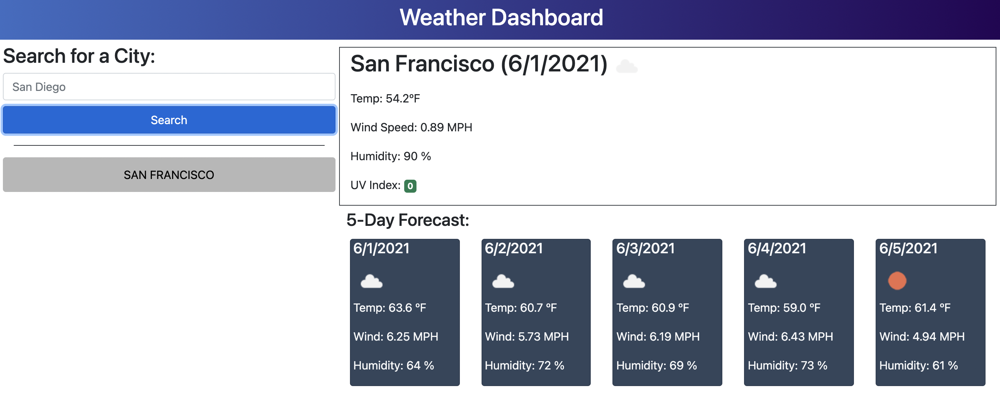
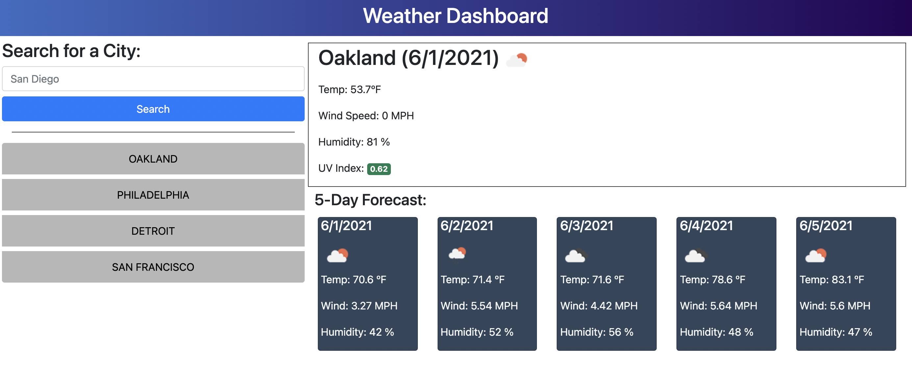
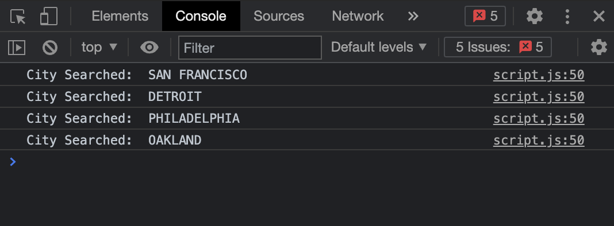
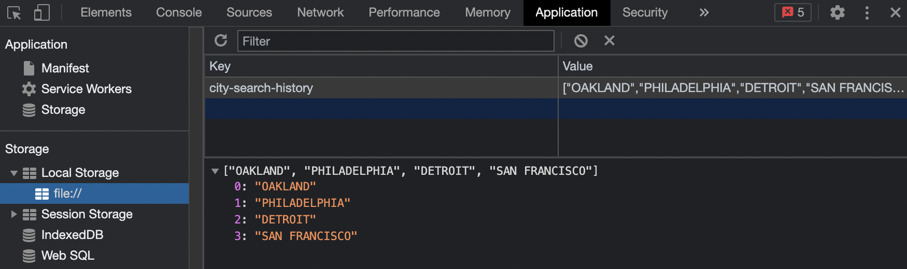
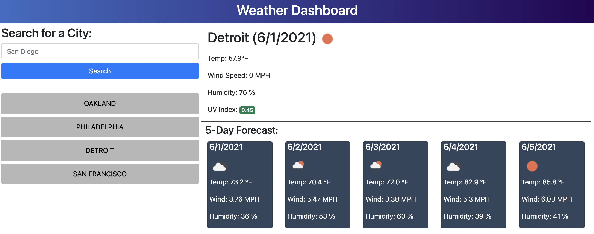

# Weather Dashboard

This site will help you see the weather outlook for multiple cities. 
This information will help you plan a trip accordingly!
You can input a city name and important weather information collected from the OpenWeather API will be displayed.

Follow this link to check it out:
[Weather Dashboard](https://abergtra.github.io/challenge-06/)

## User Interface

The initial page provides a form input and search button:


You can type any city in the form input and press the search button:


## User Interaction

After pressing the search button, the display will update with the current weather information and a 5-day forecast:



The user can add mulitple cities and they will be listed under the search button:



Opening the console will show the order each city was searched:



These searched cities are saved in the Local Storage:



The user can click between the the list of cities created to compare weathers between cities!



Don't worry, refreshing the page won't lose the cities your searched.
Good luck planning a successful trip free of meteorogical issues!

## Future Improvements

The OpenWeather API provides a lot of different information!
Here are some possible future improvements to look out for:

```bash
- Display important weather alerts.
- Allow users to get forecasts with specific date ranges.
- Enable users to specify a country with each search so they can travel internationally.
```
If you have any suggestions for improvements, please do not hesitate to contact the author!

## Author

Asher Bergtraun